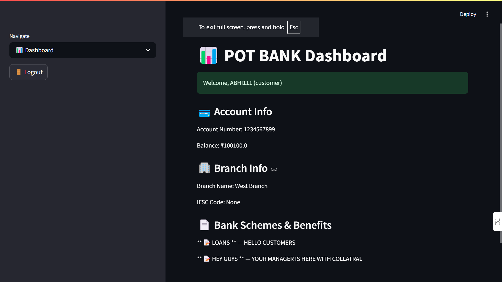

# 🏦 **THE POT BANK – Bank Management System**

Welcome to **THE POT BANK** — a modern, secure, and fully functional banking system built with **Python** , **Streamlit** , and **MongoDB** .


---

### 📌 Features

✅ **Role-based access:**

- Manager, Employee, Customer logins
- Secure JWT-based session authentication

✅ **Banking Operations:**

- Transfer funds securely
- View account balance and branch info
- Register users (Customer/Employee/Manager)

✅ **Manager Dashboard:**

- Add/view bank branches
- Add custom schemes and benefits
- View all users and accounts

✅ **Modern UI using Streamlit**

✅ **Fully integrated with MongoDB Atlas**

---

### 🧠 Tech Stack

| Layer         | Tech                     |
| ------------- | ------------------------ |
| 🐍 Backend    | Python 3, Streamlit, JWT |
| 💾 Database   | MongoDB (via PyMongo)    |
| 🔐 Auth       | bcrypt, PyJWT            |
| ☁️ Deployment | Streamlit Cloud          |

---

### 🚀 Setup Instructions

#### 🔧 Prerequisites

- Python 3.8+
- Streamlit (`pip install streamlit`)
- MongoDB Atlas (cloud URI)

#### 📦 Install Dependencies

```bash
pip install -r requirements.txt
```

#### 🔐 Setup `.env`

Create a `.env` file in your root folder:

```env
MONGO_URI="your-mongodb-uri"
SECRET_KEY="your-jwt-secret"
```

#### ▶️ Run the App

```bash
streamlit run main.py
```

---

### 📂 Project Structure

```
harshitera1-bankdbms/
├── main.py
├── requirements.txt
├── database/
├── backend/
├── models/
├── frontend/
└── README.md
```

---

### 🛠 Admin Roles & Permissions

| Role     | Permissions                             |
| -------- | --------------------------------------- |
| Manager  | Register users, manage branches/schemes |
| Employee | View dashboard, assist transfers        |
| Customer | View account, transfer funds to others  |

---

### 🌐 Deployement

[Visit here!](https://thepotbank.streamlit.app/)

---

### 📸 Screenshots



---

### 🤝 Author

- [Harshit Kumar](https://github.com/harshitera1) – Developer
